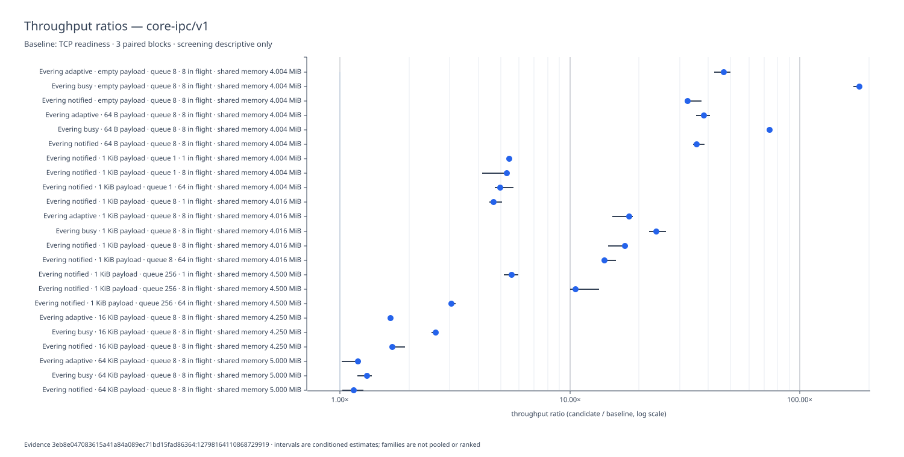
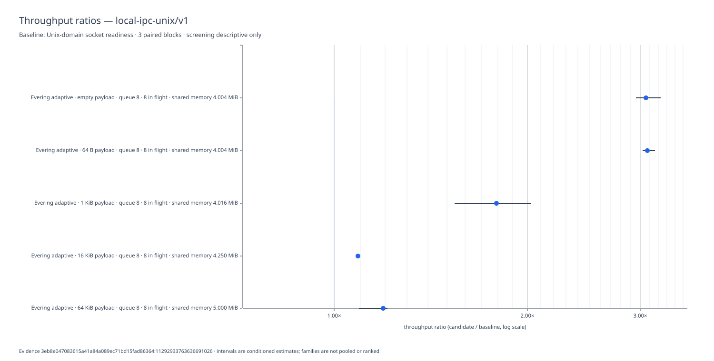
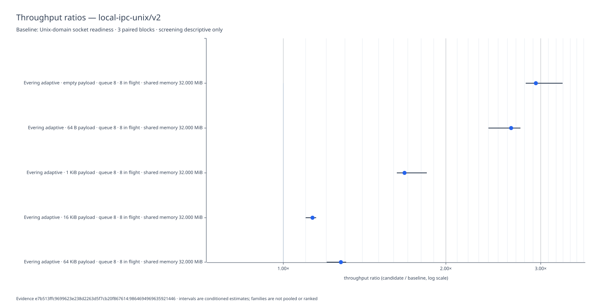

# Evering IPC: registered methods and validity report

## Abstract

This study asks when an Evering shared-memory request/response channel changes
end-to-end throughput relative to a framed stream between two processes. The
core family uses IPv4-loopback TCP; the first Unix extension uses a
Unix-domain stream (UDS). The primary quantity is the paired ratio of fully validated
operations per second under an exact platform, payload, capacity, in-flight
window, waiting policy, memory extent, and allocator geometry. It is not a
measurement of an isolated ring instruction.

The candidate may avoid kernel transport and payload copies that the stream
necessarily performs. Those differences are part of the whole-system estimand,
not proof that any single queue, allocator, or notification mechanism caused the
result. Mechanism attribution requires separate symmetric measurements.

No confirmatory performance result exists yet. Historical revision-1
Tumbleweed screening completed 108 core and 30 Local trials. A clean-source
revision-2 Local screening at `e7b513ffc9699623e238d2263d5f7cb20f867614`
completed 30/30 trials after replacing implicit adaptive Pool geometry with one
registered `64 B..64 KiB` range. Its three-block Evering/UDS ratios range from
1.132 to 2.938. Screening is descriptive and authorizes no
faster/slower/equivalent decision. Revision 2 entered the notified wait path;
it therefore supersedes revision 1 only as current implementation evidence, not
as a controlled longitudinal comparison.

Earlier incomplete Windows artifacts remain diagnostic only. Their stream
failure motivated the shared sliding-window driver and constrained-buffer
regression; no row from an incomplete artifact enters analysis.

## Research question and estimand

The primary question is:

> For a declared two-process, one-coordinator/one-worker request/response
> workload, how does Evering change the rate of fully validated operations
> relative to a framed IPv4-loopback TCP stream when logical work,
> application-visible capacity, in-flight bound, trial lifecycle, and analysis
> are matched?

The Local IPC extension asks the same conditioned question for Evering adaptive
relative to UDS readiness on one observed Unix host. The families are never
pooled.

For candidate arm `E`, baseline arm `S`, and condition `c`, the estimand is

`R(c) = throughput(E, c) / throughput(S, c)`

where throughput is `validated_operations / timed_seconds`. `R(c)` is defined
only from complete, successful, paired blocks. There is no aggregate ratio
across platforms, payloads, policies, or resource geometries.

The study answers a deployment-level question: the elapsed cost of accepting,
transporting, transforming, returning, and validating a bounded set of
requests. It does not directly answer:

- how many nanoseconds one ring transition takes;
- whether shared memory is universally faster than sockets;
- whether one allocator, wait primitive, or runtime caused the observed ratio;
- how either system behaves with multiple producers, multiple workers, remote
  peers, unidirectional traffic, or a long-lived process pool;
- tail latency, CPU efficiency, energy efficiency, or equal-memory efficiency.

Those are separate estimands and require separately registered experiments.

## Claim ladder

Claims are admitted in increasing order of strength:

1. **Correctness:** every accepted request is returned once with the exact
   operation number and transformed payload.
2. **Conditioned association:** complete paired evidence establishes a
   throughput ratio under the recorded condition.
3. **Practical decision:** the familywise interval places that ratio above,
   below, or inside the registered equivalence band.
4. **Bounded explanation:** separate mechanism evidence is consistent with a
   named contributor to the whole-system result.
5. **Causal attribution:** not provided by this study.

A lower claim never implies a higher one. In particular, a large throughput
ratio does not identify its cause.

## Compared systems

### Evering candidate

The coordinator creates a platform shared-memory object, one explicit
recoverable Pool, and one bounded bidirectional channel. Each timed request
allocates and copies the deterministic payload into that Pool, publishes a
typed envelope, and notifies according to the selected retry policy. The worker
admits the same Block, transforms its bytes in place, and publishes it back. The
coordinator admits and validates the returned Block. Setup, resource exchange,
channel/Pool creation, and final removal are outside timed work.

### Stream baseline

The coordinator creates one IPv4 loopback TCP connection to one fresh worker.
Both endpoints enable `TCP_NODELAY`. Each request and response contains a
12-byte operation/length header and the full payload. The sender constructs a
frame, the receiver allocates a payload buffer, and the worker transforms that
buffer before writing a framed response. The registered coordinator is a
single-thread duplex endpoint that uses the existing current-thread Tokio
runtime for readable/writable readiness; the worker uses blocking reads and
writes. Connection setup and child creation are outside timed work.

### Unix-domain stream baseline

The Unix-only Local family uses the same framing, client state machine,
workload, validation, scheduling, and analysis as TCP. A parent-owned temporary
directory supplies one exclusive endpoint; the listener binds before worker
spawn, and the owner guard removes only that endpoint. The measured client is
statically specialized for Tokio UDS readiness with no trait object in the
trial loop.

This is intentionally a real portable stream baseline rather than a synthetic
shared-memory imitation. Consequently the arms match logical service and bounds,
not internal byte movement. The result includes the kernel path, framing,
copying, allocation, synchronization, and validation each implementation needs
to provide that service.

## Fairness model

Fairness means **semantic equivalence with transparent physical differences**.
It does not mean forcing both implementations to use the same internal
algorithm.

Matched properties are request bytes, transform, response validation,
application-visible capacity, in-flight bound, process topology, phase
boundaries, registered duration class, and block scheduling. Total operation
count may differ by arm but is separately piloted, frozen before block 0, and
fully conserved. Deliberately different properties are transport, framing,
memory ownership, allocation path, copy count, and retry/wait implementation.
These differences must be reported because they explain what the whole-system
ratio contains.

The comparison is invalid if an arm silently weakens validation, drops work,
uses a different logical window, falls back to another transport, or moves
required timed work into setup. A physical optimization is not unfair merely
because the other arm cannot use it; exposing that optimization is the purpose
of a whole-system comparison.

## Present evidence status

| Evidence | Status | Permitted conclusion |
|---|---|---|
| Windows and Tumbleweed smoke | complete | Both arms can exchange and validate the registered smoke cases |
| Windows 10-block exploratory run | valid partial, not complete | The matrix exposed a stream batching defect |
| Tumbleweed core revision-1 screening | historical: 3 blocks, 108/108 trials | Descriptive conditioned ratios only |
| Tumbleweed Local revision-1 screening | historical: 3 blocks, 30/30 trials | Descriptive conditioned ratios only |
| Tumbleweed Local revision-2 screening | current: 3 blocks, 30/30 trials | Descriptive conditioned ratios only; no cross-revision decision |
| Windows excluded pilot/count manifest | complete locally, not retained evidence | Confirms the calibration and admission path works; no throughput claim |
| Windows one-block manifest-authorized run | complete locally, diagnostic only | Confirms per-arm count conservation; too few blocks for an estimate |
| Focused confirmation | authorized but not run | No practical faster/slower/equivalent decision |

The retained [core evidence](evidence/core-ipc-tumbleweed-screening-20260731.jsonl),
[Local evidence](evidence/local-ipc-unix-tumbleweed-screening-20260731.jsonl),
and generated [combined report](report.md) have SHA-256 digests
`00c6fc9f052bf0b805e7e418ae49fff9b309fef8394394963b16e5e0d6b9c693`,
`cfd9af2e35459f644537e545a720cba51501f8308f09825ec1b2a5b28e5b0b71`,
and `33d287506fffae59297794a682a009ae38da1ee7367b9c8fa80be7da0f1defc6`.
Local and core record dirty digests `14b86ac1df9347d1` and
`6e0718d77b9964a5` because this paper and retained artifacts changed between
family runs. Benchmark production code did not change; the families remain
independent and are not pooled.

The current [Local revision-2 evidence](evidence/local-ipc-unix-tumbleweed-screening-20260802.jsonl),
[generated report](report-local-v2.md), and
[SVG](plots/20260802/local-ipc-unix.svg) have SHA-256 digests
`2b5eaa9ef08cb3c18d55cc68ac619efa4d08328ce50a75e52573fd26593a30fb`,
`2b094a7254aa2d18ea2fc214a9233387fac46b461679493c593264dcfc31425a`,
and `c089080c2bd3434a3064d0e2b21438abe64090175456edf7c22429742ac62d7f`.
It is clean (`dirty=false`), uses family revision 2, seed `20260802`, a fixed
32-MiB condition extent, and records the actual 16,515,072-byte Pool geometry.

### Current revision-2 Local snapshot

The bounded pilot completed ten cells in 6.2 seconds; screening completed all
30 rows in 17.2 seconds. Every row conserves requested, accepted, completed,
and validated operations. The resulting descriptive ratios are:

| Payload | Evering adaptive / UDS readiness | Descriptive 95% interval |
|---:|---:|---:|
| 0 | 2.938 | [2.814, 3.295] |
| 64 | 2.644 | [2.397, 2.750] |
| 1024 | 1.677 | [1.622, 1.842] |
| 16384 | 1.132 | [1.100, 1.149] |
| 65536 | 1.277 | [1.204, 1.308] |

All Evering rows report the same explicit Pool range and class table. Unlike
the historical snapshot, the current adaptive arm records receive stalls,
wait entry/return, and stale wakes. That path-regime change and the revised
memory/geometry contract forbid a revision-1/revision-2 `Q` comparison.

### Historical snapshot and later comparisons

The two 2026-07-31 screening artifacts are immutable historical snapshots, not
the current implementation baseline. Core contains 108/108 rows with source
revision `3eb8e047083615a41a84a089ec71bd15fad86364`, dirty digest
`6e0718d77b9964a5`, and evidence SHA-256
`00c6fc9f052bf0b805e7e418ae49fff9b309fef8394394963b16e5e0d6b9c693`.
Local contains 30/30 rows at the same revision, dirty digest
`14b86ac1df9347d1`, and evidence SHA-256
`cfd9af2e35459f644537e545a720cba51501f8308f09825ec1b2a5b28e5b0b71`.
Both used format 5, family revision 1, seed 7, three screening blocks,
x86_64 Tumbleweed under WSL, and rustc 1.97 nightly. The combined report digest
is `33d287506fffae59297794a682a009ae38da1ee7367b9c8fa80be7da0f1defc6`.

A later run gets a new artifact name and retains the old bytes. It must match
family revision, condition matrix, mode, target, host class, and observation
contract before a longitudinal comparison is attempted. For snapshot `s`, let
`R_s(c) = throughput(Evering, c) / throughput(baseline, c)`. The descriptive
relative change is `Q(c) = R_new(c) / R_old(c)`. Blocks from different snapshots
are resampled independently and are never pooled or treated as paired in time.
Absolute Evering and baseline throughput changes are reported beside `Q`; a
baseline drift or path-presence change is a regime warning, not something the
ratio silently normalizes. Screening supports only descriptive change. A
faster/slower/equivalent or regression decision requires a separately
registered focused longitudinal design and its complete evidence.

The 63.9-second core command contains 59.439 seconds of recorded trial phases:
5.336 setup/warmup, 53.951 timed work, and 0.152 drain. Its 23 conditioned
comparisons have block-ratio CV from 0.80% to 15.65%. At the reference capacity
and in-flight bound:

| Payload | Adaptive/TCP | Busy/TCP | Notified/TCP |
|---:|---:|---:|---:|
| 0 | 46.834 | 181.598 | 32.543 |
| 64 | 38.319 | 73.863 | 35.648 |
| 1024 | 18.167 | 23.715 | 17.406 |
| 16384 | 1.665 | 2.619 | 1.688 |
| 65536 | 1.198 | 1.315 | 1.152 |

The eight notified boundary comparisons at payload 1024 range from 3.058 to
14.143; the complete condition table and descriptive intervals are in the
combined report. Core timed trials range from 335.916 to 637.739 ms.

The 22-second Local command contains 18.612 seconds of recorded trial phases:
1.360 setup/warmup, 17.195 timed work, and 0.056 drain.

| Payload | Block ratios | Mean | CV | Median and descriptive 95% interval |
|---:|---|---:|---:|---:|
| 0 | 2.957, 3.063, 3.228 | 3.083 | 4.43% | 3.063 [2.957, 3.228] |
| 64 | 3.081, 3.028, 3.165 | 3.091 | 2.23% | 3.081 [3.028, 3.165] |
| 1024 | 1.542, 2.025, 1.792 | 1.786 | 13.51% | 1.792 [1.542, 2.025] |
| 16384 | 1.090, 1.097, 1.085 | 1.091 | 0.53% | 1.090 [1.085, 1.097] |
| 65536 | 1.093, 1.210, 1.194 | 1.166 | 5.43% | 1.194 [1.093, 1.210] |

All rows conserve `requested = accepted = completed = validated`; timed
durations range from 478.895 to 656.809 ms. Three blocks provide weak
descriptive intervals, the WSL host lacks several nuisance observations, and
the absence of recorded waits limits interpretation. These ratios neither
identify a mechanism nor authorize a deployment decision.

The partial exploratory file is diagnostic evidence only. Successful rows from
the same incomplete schedule may not be selected for performance analysis.
All three failures used payload 65,536, capacity 8, and in-flight 8:

| Block | Candidate policy paired with the stream row | Accepted | Completed | Validated | Status |
|---:|---|---:|---:|---:|---|
| 0 | notified | 6 | 0 | 0 | timed error |
| 4 | notified | 6 | 0 | 0 | timed error |
| 8 | busy | 6 | 0 | 0 | timed error |

The candidate policy column identifies the paired contrast; it does not change
the stream implementation. Repetition under two candidate labels is consistent
with a stream-side progress defect rather than a waiting-policy result.

## Implementation conformance audit

The registered method is normative. The original defects and their implemented
gates are:

| Requirement | Current implementation | Consequence | Required gate |
|---|---|---|---|
| Transport-buffer-independent progress | Fixed-burst historical runner could deadlock | 64-KiB work depended on socket buffering | Current sliding-window duplex pump and constrained-buffer regression are green |
| Per-arm duration calibration | Historical runner accepted one global count | Trial duration varied qualitatively by arm | Digest-bound `(condition, arm)→count` pilot is enforced before evidence creation |
| Symmetric timed boundary | Historical stream used an unacknowledged sentinel | Residual control work could enter timing | Both arms share the same driver and validated work contract |
| Waiting-path observability | A requested label did not prove the executed path | Waiting claims could be false | Format 5 records six timed path-presence booleans |
| Host controls | Historical evidence omitted material observations | Environmental drift could not be admitted | Parent and worker independently match one read-only canonical environment digest |
| Comparator semantics | Historical stream was called `blocking` | The label misdescribed execution | Current client uses Tokio readiness and records exact path presence |

These gates permit execution; they do not themselves create a statistical
result. Local revision-2 screening is complete; focused confirmation and
core-family revision-2 screening remain outstanding.

The benchmark verification suite is an explicit Cargo target at
`benches/ipc/test_main.rs`, gated by the `benchmark` feature. Ordinary `cargo test`
does not compile or run it. Run it independently with
`cargo test --features benchmark --test ipc-study`; its separate LOC ledger is
therefore a build boundary rather than a reporting convention. The executable
and test roots use ordinary sibling-module discovery; no path override or
formatter suppression is part of the benchmark.

## Logical operation

One accepted operation is exactly one request with:

- a monotonically assigned operation number;
- the declared payload length;
- deterministic payload bytes derived from the study seed and operation
  number.

One completed operation is exactly one response carrying the same operation
number and the declared deterministic transform of the complete request.
Validation checks every response byte.

A successful trial satisfies:

`requested = accepted = completed = validated`

A mismatch is a phase-specific failure with no performance value. Submitted
work is never treated as completed work.

## Contrast, arm, and block

A `ContrastKey` identifies semantic workload only:

- platform and target;
- payload;
- application-visible capacity;
- maximum in-flight operations;
- topology;
- shared extent and allocator geometry where applicable.

A `Contrast` combines that key with exactly two named arms:

- candidate: Evering with one of `busy`, `adaptive`, or `notified`;
- baseline: framed IPv4 loopback with policy `readiness`.

Implementation and arm policy are not fields of `ContrastKey`. The readiness
baseline is never duplicated under fake Evering policy labels.

One arm observation is one trial with fresh arm resources and a fresh worker
process. The benchmark coordinator process remains alive across trials.
Each block has exactly one trial for both arms of every registered contrast.
The seed deterministically randomizes contrast order, then arm order inside
each contrast. It never changes membership, work, or identity. Worker processes,
connections, mappings, heaps, and channels are not reused across units;
coordinator allocator, cache, and host-process history can persist and are
controlled only by randomized paired blocks.

## Process and phase boundary

The core topology is one coordinator process, one worker process, and one
connection or typed request/response channel pair. Producer-count and
multi-worker claims require a separately registered experiment.

Every trial has:

1. setup: resource creation, mapping/admission, child spawn, handle exchange,
   runtime registration, and fixed-buffer allocation;
2. warmup: identical logical request/response work;
3. readiness: one reserved request/response on the measured transport,
   validated by the coordinator, followed by no release message;
4. timed work: exact admitted requests, backpressure, allocation/copy required
   by the arm, response completion, and full validation;
5. drain: close, remaining notification consumption, child wait or exact
   kill-and-wait, reclamation, and unmapping;
6. evidence persistence outside the timed interval.

After the ready response, the coordinator requires zero staged and outstanding
work, resets timed observations, and starts the clock immediately before
operation zero. Normal operation identities and warmup cannot reach the
reserved ready identity. The clock stops after validation of the last requested
response. Setup, timed, and drain each have one absolute deadline. An I/O retry
cannot restart a phase timeout. Every spawned child reaches one observed
terminal state.

## Work and resource equivalence

- Each arm uses its exact frozen requested count and deterministic payloads.
- Paired counts may differ; operation semantics, duration class, window,
  topology, phase meaning, and validation remain matched.
- Capacity is the maximum application-visible outstanding record count.
- Stream batching is `min(capacity, in_flight, remaining)`.
- The stream uses one connection, enables `TCP_NODELAY` on both endpoints, and
  records actual socket-buffer sizes.
- Evering records actual shared extent and admitted allocator geometry.
- No equal-memory claim is made unless all relevant buffers and bounds were
  observed. Otherwise memory comparability is explicitly unavailable.
- Unsupported arm/condition pairs remain explicit without timing.
- Setup, warmup, drain, error, and validation rules are identical in meaning,
  even when their transport mechanics differ.

## Condition ledger

Every condition belongs to one of five classes. A report must preserve the
class; merely recording a value does not make it controlled.

| Condition | Role | Registered values or rule | Current observability |
|---|---|---|---|
| Payload | experimental factor | 0, 64, 1,024, 16,384, 65,536 bytes | requested and observed |
| Evering retry | experimental factor | busy, adaptive, notified | format 5 records path presence; exact fallback/coalescing counts remain separate diagnostics |
| Capacity | experimental factor | reference 8; boundary 1 and 256 | requested and observed |
| In-flight | experimental factor | reference 8; boundary 1 and 64 | requested and observed |
| Platform | separate family | native Windows; openSUSE Tumbleweed under WSL | OS, target, architecture, host string |
| Topology | fixed | one coordinator, one worker, one channel/connection | recorded as `1c1w` |
| Logical transform | fixed | every payload byte XOR `0xa5` | validated byte-for-byte |
| Connection count | fixed | one | implied by runner; not an evidence field |
| Stream framing | fixed | 8-byte operation, 4-byte length, full payload | fixed by implementation; not versioned separately |
| Stream transport | fixed | IPv4 loopback TCP with `TCP_NODELAY` and coordinator readiness | transport and observed socket buffer sizes |
| Shared extent | derived factor | `next_page(4 MiB + 2 × capacity × max(payload, 64))` | requested and observed |
| Allocator geometry | derived factor | `Geometry::auto(extent)` | observed debug representation |
| Warmup | fixed per artifact | registered before execution | metadata |
| Operation count | fixed per arm after pilot | predetermined and conserved; paired arms may differ to enter one duration class | pilot manifest and each evidence row |
| Block and arm order | randomized control | deterministic from seed | schedule identity and row order |
| Trial process lifetime | fixed | persistent coordinator; fresh worker and arm resources | enforced by runner |
| Lifecycle deadline | fixed | one absolute trial deadline capped by one family command deadline | remaining time is passed through setup, timed work, drain, and reap |
| CPU model | nuisance condition | no target value | observed |
| CPU affinity | nuisance condition | externally prepared, never mutated | inherited process mask observed and worker-matched |
| Frequency/power policy | nuisance condition | externally prepared or declared unavailable | observed when the platform exposes it |
| Page size | nuisance condition | observe, do not assume | observed |
| Socket buffer geometry | nuisance/effect modifier | OS-selected; must not determine progress | observed; constrained-buffer progress is tested |
| Background load/thermal state | nuisance condition | stabilize and describe session | explicitly unavailable unless externally documented |
| Compiler and source | blocking identity | exact Rust compiler, revision, dirty digest | recorded |

An unavailable value remains a limitation. It must not be converted into an
assumption during analysis. Windows and WSL Tumbleweed differ in kernel,
virtualization, scheduler, timer, and host interaction; they are independent
families even when executed on the same physical computer.

The benchmark does not set affinity or power policy. The operator may prepare
them externally. Format 5 observes CPU identity/architecture/logical count, process
affinity, OS/kernel and native/WSL identity, page size, available power/governor
state, compiler/target, and source identity. Each worker independently admits
the parent-supplied expected digest before connecting; the later empty `ready`
response proves that admission and transport readiness both completed.
The pilot manifest binds the snapshot and evidence admission rejects observable
drift.

Power, thermal, background-load, and physical-core/SMT information that cannot
be observed remains nuisance context, not a new experimental factor. It may
widen intervals or qualify magnitude. Qualitative decisions remain conditional
on the recorded platform/session; Windows and Tumbleweed are reported
separately if they disagree.

### Factor semantics and aliasing

The registered workload is closed-loop with a sliding window. The coordinator
admits whenever
`accepted - completed + staged < min(capacity, in_flight)`, where `staged` is
zero or one partially committed request. Each complete response immediately
releases one slot; there is no send-window/receive-window batch barrier. This is
not an open-loop arrival process and does not model overload, queueing delay
under an external arrival rate, or independent clients.

The current runner executes this sliding window and records `window`. Older
formats are not admitted or pooled with the current study.

`capacity` and `in_flight` are therefore aliased through their minimum for
logical concurrency. They are not interchangeable internally: changing
capacity also changes Evering's ring allocation and derived shared extent,
whereas the stream has no corresponding application queue allocation.
Consequently:

- an in-flight effect may be interpreted as a window effect while capacity and
  geometry remain fixed;
- a capacity effect can combine window, ring-layout, and shared-memory effects;
- two cells with the same minimum window are not necessarily physically equal;
- the study cannot estimate independent capacity and in-flight coefficients
  from these cells.

A zero-byte operation still carries an envelope or 12-byte stream header and
exercises synchronization, framing, and validation. It means zero application
payload, not zero transported metadata or zero work.

## Timed work and cost accounting

The clock begins immediately after the arm-specific warmup/ready exchange and
ends after the final response is fully validated. The primary ratio therefore
includes:

| Cost | Evering | Stream |
|---|---|---|
| Deterministic request generation | included | included |
| Request allocation | recoverable Pool reservation | frame and payload `Vec` allocation |
| Request payload copy | into shared allocation | into user frame, then through socket path |
| Request publication/transport | ring publication and possible notification | framed socket writes |
| Worker receive | shared allocation admission | frame read and payload allocation |
| Transform | in-place XOR | in-place XOR |
| Response transport | same allocation republished | full framed socket response |
| Coordinator receive/validation | shared allocation open and byte validation | frame read, payload allocation, byte validation |
| Setup, mapping, spawn, handle exchange | excluded | excluded |
| Drain, child wait, channel removal | excluded | excluded |
| Evidence persistence | excluded | excluded |

The table is an ownership-level accounting model, not an asserted count of
hardware copies, cache misses, syscalls, or context switches. Those counts
depend on platform behavior and need symmetric instrumentation. Logical GiB/s,
when reported, is based on application payload and must not be described as
memory bandwidth or wire bandwidth.

Zero-byte trials measure control-path throughput. They cannot support a
payload-bandwidth claim. Large-payload trials combine control and byte movement.
Comparing them may show a conditioned change in association, but subtracting one
from the other is not an admitted decomposition.

## Progress equivalence

Capacity and in-flight are application bounds, not permission to rely on
transport buffer capacity. For every supported condition, either arm must make
progress with only its declared application window and bounded internal state.

The stream coordinator preserves the logical window while interleaving bounded
send and receive progress. A regression with deliberately constrained socket
buffers at payload 64 KiB, capacity 8, and in-flight 8 prevents progress from
depending on OS socket-buffer size.

## Registered matrices

Reference values are payload 1024 bytes, capacity 8, in-flight 8, a fixed
32-MiB shared extent, and the registered `64 B..64 KiB` Pool geometry. Every
Evering row records the actual class sizes and slot counts.

### Smoke

Smoke runs 101 operations per selected arm as a correctness check only. It produces no
performance claim.

### Screening

The core family has 36 arm rows per block:

- all 15 combinations of payload `[0, 64, 1024, 16384, 65536]` and Evering
  policy `[busy, adaptive, notified]` at capacity 8 and in-flight 8;
- capacity `[1, 256]` at payload 1024, in-flight 8, notified;
- in-flight `[1, 64]` at payload 1024, capacity 8, notified;
- boundary pairs `(capacity, in-flight)` of `(1,1)`, `(1,64)`, `(256,1)`, and
  `(256,64)` at payload 1024, notified.

The Local family has ten arm rows per block: five payloads times Evering
adaptive and UDS readiness at capacity 8 and in-flight 8. Screening uses three
complete paired blocks. Its intervals and capacity/in-flight observations are
descriptive.

### Focused confirmation

The focused family is fixed before screening: five payload contrasts between
Evering adaptive and the readiness baseline at capacity 8 and in-flight 8. It
uses 15 complete paired blocks per platform. Capacity, in-flight,
memory-geometry, or topology confirmation
requires a later preregistered family.

Windows and openSUSE Tumbleweed are separate artifacts and separate reports.

## Pilot and stopping

Before screening, an excluded pilot selects one exact operation count per
`(contrast, arm)` so each arm enters the registered duration class without
approaching the timed deadline. Paired counts may differ, but each is frozen
before block 0 and exactly conserved during evidence execution.

For `W = min(capacity, in_flight)`, algorithm 3 begins at
`max(64, 32 × W)` rounded to a multiple of `W`. Fresh trials scale toward a
measurable 50 ms observation for at most eight attempts, then freeze a checked
500 ms target count. The manifest records every ramp, the selected count,
source/environment/condition identity, and digest. Calibration failure appends
one sanitized `ABORT` row; an incomplete manifest is neither admissible nor
resumable. Pilot rows are excluded from performance evidence.

One absolute command deadline governs whether new work may start and caps each
trial through setup, warmup, measurement, drain, and child reap. Each trial
receives the lesser of the family command remainder and its recorded per-trial
limit. Local pilot, screening, and focused limits are respectively 45, 90, and
240 seconds. A supervising process may add at most 20 seconds only to clean up
a failed command. Budget expiry is an error and can never be encoded as low
throughput.

Pilot progress prints one flushed stderr line at cell start and completion.
Screening prints one flushed stderr line per completed trial and one compact
block summary. Stdout is reserved for terminal machine-readable output;
progress never authorizes, repairs, or excludes an artifact.

## Waiting policies

- `busy` retries the same nonblocking shared operation without an OS wait.
- `adaptive` performs a recorded bounded spin, then follows the notified path.
- `notified` performs check-arm-recheck through the shipped sticky
  notification and immediately retries authoritative shared state after wake.
- `readiness` names the framed stream comparator. Its single coordinator thread
  waits through Tokio for readable/writable readiness when immediate
  nonblocking I/O cannot progress; its worker uses blocking I/O. Readiness is
  advisory and must be followed by authoritative I/O.

The three Evering policies share layouts, payload representation, operation
path, counts, validation, close, and cleanup. They differ only at retry.
Notification is advisory: it never publishes, consumes, closes, rolls back a
committed record, or proves peer death.

Format-5 trials record only whether each timed path occurred:

- `send_stalled`: a logical send could not commit immediately;
- `recv_stalled`: no complete response was immediately available;
- `wait_entered`: runtime/OS waiting was entered;
- `wait_returned`: waiting returned before the deadline;
- `stale_wake`: the immediate authoritative retry made no progress;
- `partial_io`: transport bytes progressed without a complete logical commit.

These are process-local booleans, reset after `ready` and retained on success or
failure. They prove path presence, not frequency or cost. Exact retry, spin,
wait, wake, stale-wake, and notification-coalescing counts require a separately
instrumented diagnostic run and cannot be mixed into primary throughput.

## Evidence format and persistence

Format 5 is newline-delimited JSON with one tagged `header`, ordered `trial`
rows, and one terminal `end`. There is no production compatibility parser for
older study formats. The header binds family/revision, source and dirty digest,
compiler/target, environment, command, mode, seed, schedule, blocks, warmup,
per-trial limit, expected rows, and adaptive-spin bound. Each trial records its
scheduled identity, requested and conserved counts, timed duration, three phase
durations, exact observed resources, path-presence bits, and terminal status.
The end record binds row count, schedule, and the digest of all preceding
JSONL bytes.

The recorder uses `create_new`, synchronously appends and `sync_data`s every
validated row, validates the whole study, then appends and `sync_all`s the end
record. An interrupted or failed file remains a readable but incomplete prefix
at its requested name. It has no analysis authority. The first mandatory
failure stops lazy evaluation before any later trial starts, and no rerun
overwrites an existing path. The design provides inspectable fail-fast
evidence, not atomic final-name publication or parent-directory durability.

When driven from Windows through WSL, use
`C:\Windows\System32\wsl.exe --distribution tumbleweed --cd
/mnt/e/Proj/dev/evering sh -lc ...` from the Windows user context. The managed
sandbox token sees an empty distro registry, and Tumbleweed clears its `/tmp`
mount when the instance stops; retained staging therefore uses ignored
`target/study/`. Direct invocation of the already-built absolute benchmark
binary avoids unnecessary Cargo freshness rebuilds on the mounted NTFS tree.

## Analysis

For each complete paired block:

`log_ratio = ln(evering_operations_per_second / baseline_operations_per_second)`

The point estimate is `exp(median(log_ratio))`.

The deterministic percentile bootstrap resamples complete paired blocks 10,000
times. Its seed is derived from the study seed and stable contrast encoding.
Screening reports descriptive 95% intervals without faster, slower, equivalent,
or crossover decisions.

For a focused family of `m` contrasts, each contrast uses the two-sided
Bonferroni bootstrap tails `0.05 / (2m)`, providing at least 95% familywise
coverage.

The practical-equivalence band is `[0.95, 1.05]`:

- interval wholly inside the band: practically equivalent;
- interval wholly above 1.05: candidate directionally faster;
- interval wholly below 0.95: candidate directionally slower;
- otherwise: inconclusive.

Analysis resamples blocks, never individual rows; rejects incomplete pairs,
unregistered matrices, or duplicate family artifacts; never pools artifacts or
mutates raw evidence; and produces deterministic family-ordered Markdown with
traceable artifact, contrast, and block identities.

`cargo bench --bench ipc --features benchmark -- analyze <evidence>...` performs
that registered analysis without a statistics or dataframe dependency. Every
input must be one complete format-5 artifact matching its registered family,
revision, mode, seed, blocks, and exact matrix. A report admits at most one
artifact per family and renders independent sections in stable family order.

The optional `plot` feature adds only Plotters' SVG backend. Run
`cargo bench --bench ipc --features benchmark,plot -- plot <new-output-dir> <evidence>...`.
The renderer refuses an existing output directory and consumes the same admitted,
sorted `Analysis` values as Markdown; it does not recompute estimates, pool
families, rank arms, or promote screening intervals to decisions. It emits one
byte-stable logarithmic ratio plot per family.

Each row spells out the policy, payload per message, queue capacity, maximum
messages in flight, and total shared-memory extent; binary sizes use KiB/MiB.

The timed execution/transport core retains its 2,000 nonblank, noncomment line
ceiling. Offline native analysis and its command admission have a separate
280-line natural-format ceiling because they do not participate in the timed
path; tests are
accounted separately from both. The optional renderer has its own 220-line
ceiling.

Latency ratios, combined coordinator-plus-worker CPU ns/op, logical GiB/s, and
kernel counters are secondary only when collected symmetrically. Instrumented
throughput, latency, and counter runs are separate when instrumentation changes
the primary path.

## Mechanism measurements

Mechanism evidence is separate from IPC trials. Registered operations are:

- reserve/publish;
- claim/recycle;
- shared allocate/release;
- notification signal/consume;
- one complete process exchange.

Each row names whether it is same-process, cross-thread, or cross-process,
records exact iterations and state reset, and includes a non-elided control
loop using `std::hint::black_box`. Net and gross costs are reported; negative
subtracted time is not manufactured into zero or a positive result.

Mechanism rows cannot be decoded or reported as whole-system throughput. An
association between mechanism and process evidence supports only a bounded
explanation.

Run the registered external harness with
`cargo test --release --all-features --test micro -- --nocapture`. It emits
`MICRO` rows for all five boundaries. Platform/session/process setup and state
reset live in the external test harness and remain outside each measured
transition; this avoids duplicating the IPC runner and preserves the shared
micro/recovery production ceiling. The harness is diagnostic evidence, not a
throughput claim or a retained report artifact.

The allocation row measures the explicit GeneralHeap/PBox 64-byte
allocate/initialize/release surface. It does not claim to isolate raw Talc
mutation from mandatory typed initialization or admission; any narrower
allocator claim requires a separately registered internal instrumentation
surface.

## Recovery experiment

Recovery is correctness evidence, not a throughput sample. One fresh worker is
terminated at each distinct shared-memory cut:

- after reserve, before a value is staged;
- before publish;
- after publish;
- after claim;

“After claim” and “before recycle” name the same durable claimed state because
the safe `Claim::take` transition couples moving the value with recycling the
slot. They are one registered cut. The study does not add an otherwise
unobservable lifecycle state merely to split those procedural labels.

After terminal `Exit` from the exact retained `Supervisor`, the coordinator
admits death, rechecks and drains authoritative shared state once, repairs,
reaps, and classifies each accepted operation.

Run `cargo test --release --all-features --test recovery_process --
--nocapture`. Each `RECOVERY` row records the cut, exact exit code, accepted,
validated, recovered-loss, duplicate, and fabricated counts, followed by
recovery nanoseconds. The notification only releases the advisory wait; the
retained `Exit` remains the sole death evidence.

Valid recovery satisfies:

`accepted = validated + recovered_loss`

Duplicate and fabricated records are zero. Timeout, notification error, pipe
closure, PID, or heartbeat never authorizes death admission. The current
public reap result proves complete repair or returns its still-live authority;
it does not expose layout or quarantine counters. The harness therefore does
not manufacture those values. It instead verifies channel removal, dead-slot
reuse at a newer generation, and a subsequent clean attach/exchange/removal.

## Interpretation of large ratios

A large observed ratio is plausible but is not self-authenticating. Evering can
avoid kernel stream framing and can return the same shared allocation after an
in-place transform. For zero-byte busy trials, its hot path may be mostly
shared atomics and cache coherence while the stream still performs framed
kernel I/O and scheduling. This can produce an order-of-magnitude difference
without measurement fraud.

The same structural asymmetry also makes the ratio sensitive to omitted
conditions:

- delayed acknowledgement dominated the stream until `TCP_NODELAY` was enabled;
- socket buffer capacity currently determines whether the 64-KiB batched
  baseline makes progress;
- a global count of 1,000 leaves some candidate trials far below the registered
  250-ms duration, increasing timer, scheduler, startup-residue, and frequency
  sensitivity;
- continuous availability can make a nominally notified policy complete
  without sleeping, so the policy name alone does not establish wake cost;
- setup and teardown dominate command wall time but are outside the throughput
  estimand;
- payload copying, allocation, kernel work, and cache behavior are deliberately
  included but not separately observed.

Therefore the correct reading of an unexpectedly large ratio is:

1. verify conservation and artifact completeness;
2. verify both arms ran long enough under the same frozen count;
3. audit transport progress and fallback observations;
4. inspect paired block dispersion and the familywise interval;
5. reproduce in a separate platform family;
6. use symmetric mechanism or counter evidence before proposing a cause.

The study reports the ratio if it survives these gates. It does not shrink or
discard a valid large effect merely because it looks surprising, and it does
not promote a surprising exploratory value into a result.

## Threats to validity

### Construct validity

Validated operations per second represents a bounded request/response service,
not general IPC performance. The baseline is portable IPv4-loopback TCP, not
the fastest platform-specific IPC facility. Busy, adaptive, notified, and the
stream comparator follow different progress strategies; comparing them answers
policy-qualified questions only.

The application-visible capacity and in-flight window are matched, but internal
memory use is not. An equal-memory claim is unavailable until process-private
buffers, socket buffers, mappings, allocator overhead, and runtime state are
measured consistently.

### Internal validity

Paired randomized blocks reduce temporal drift but do not remove it. Unpinned
threads, unavailable power controls, background load, thermal changes, page
faults, allocator state, and virtualization can affect the ratio. Fresh workers
and arm resources limit cross-trial state, but the persistent coordinator and
host retain allocator, cache, scheduler, and system history. Setup can also
leave arm-specific residue immediately before the timed ready boundary.

The deterministic payload generator and byte validation execute in both arms,
but their memory ownership differs. Compiler optimization is constrained by
observable inter-process exchange and validation; it is not assumed absent.

### Statistical conclusion validity

Very short trials can produce precise-looking but unstable ratios. The
per-contrast pilot and 250-ms minimum are therefore blocking requirements.
Blocks, not individual operations, are the resampling units. Serial dependence
between blocks remains a limitation rather than being assumed away.
Bonferroni intervals protect the registered focused family, not arbitrary
post-hoc subsets. Ten screening blocks are descriptive; thirty focused blocks
do not guarantee useful power when environmental variance is high.

The equivalence interval expresses the registered practical threshold, not
proof that implementations are identical. Failure to establish faster, slower,
or equivalent is reported as inconclusive.

### External validity

Results apply only to the recorded compiler, revision, host conditions,
platform family, two-process topology, message transform, connection count,
payloads, bounds, and policies. Native Windows results do not predict WSL
Tumbleweed, and neither predicts bare metal, another CPU architecture, a
container host, multi-producer load, crash-heavy service, or network transport.

### Instrumentation validity

Wall-clock throughput alone cannot distinguish CPU execution, blocked time,
context switches, cache misses, page faults, or copying. Optional counters must
be collected symmetrically in a separate instrumented run if their collection
changes either hot path. Missing counters remain missing; elapsed time is not a
proxy for CPU consumption.

## Invalidity rules

A trial has no performance value when:

- phase boundaries differ from the declared arm;
- requested/accepted/completed/validated conservation fails;
- a response number or payload is wrong, duplicate, or fabricated;
- the child is not exactly waited or killed-and-waited;
- a phase exceeds its absolute deadline;
- resource, queue, or task growth exceeds its declared bound;
- fallback, timeout, comparator error, or unsupported behavior is encoded as
  elapsed success;
- metadata, schedule, arm pair, environment, or revision is absent or
  inconsistent;
- the operation count/order cannot be reproduced;
- instrumentation changes one arm only.

Invalid and unsupported rows remain in partial evidence with a reason and no
elapsed performance value. No post-hoc exclusion is permitted.

## Comparator admission

The mandatory baseline is the real two-process framed IPv4-loopback stream.
Platform-native Unix-domain sockets and Windows named pipes are separate
transport factors, not aliases of the portable baseline.

Optional whole-system admission order is current `shmipc` on Linux, then
iceoryx2 only for a named cross-platform middleware question. Every admitted
row records exact version, runtime, geometry, capacity, batching, allocation,
and fallback behavior. Fallback is invalid or a separately named arm.

Monoio is a runtime-driver candidate, not an IPC comparator. It may enter a
separate Linux/macOS study only over the same transport, topology, connection
count, work, validation, and bounds. No optional dependency is added before a
written equivalence/admission review.

## Evidence retention and reporting

Pilot and unreferenced exploratory artifacts remain ignored. Every artifact
cited by a retained report is copied unchanged into
`benches/evidence/`, revalidated there, and committed with the report. If a
cited artifact exceeds 5 MiB, publication stops until a content-addressed
external archive is approved.

Each report claim names artifact, revision, platform, target, topology,
payload, capacity, in-flight, candidate/baseline policies, extent/geometry,
block count, estimator, familywise interval, and decision. Negative, null,
unsupported, invalid, and inconclusive results remain visible. No claim
generalizes beyond its recorded conditions.

## Core completion

Core completion requires:

- evidence format 5, deterministic paired scheduling, absolute lifecycle deadlines,
  process-crash persistence, and complete validation;
- matched Evering busy/adaptive/notified and readiness-stream arms;
- native registered analysis;
- mechanism and recovery evidence;
- 3-block screening and 15-block focused families on Windows and Tumbleweed;
- a checked-in condition-qualified report and every cited evidence artifact.

Optional comparators, runtime drivers, latency distributions, process counters,
plots, and hosted regression tracking are not core-completion requirements.
